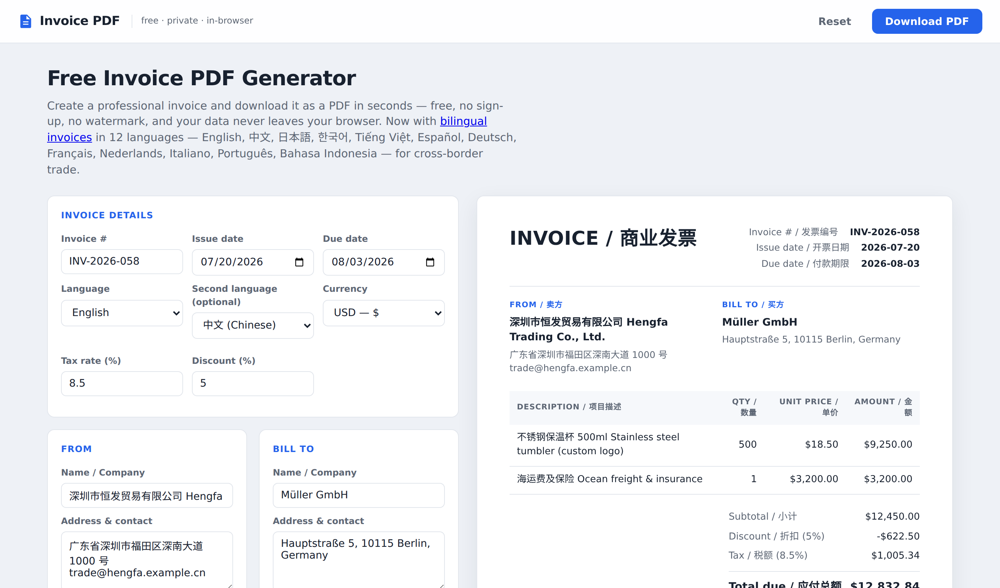
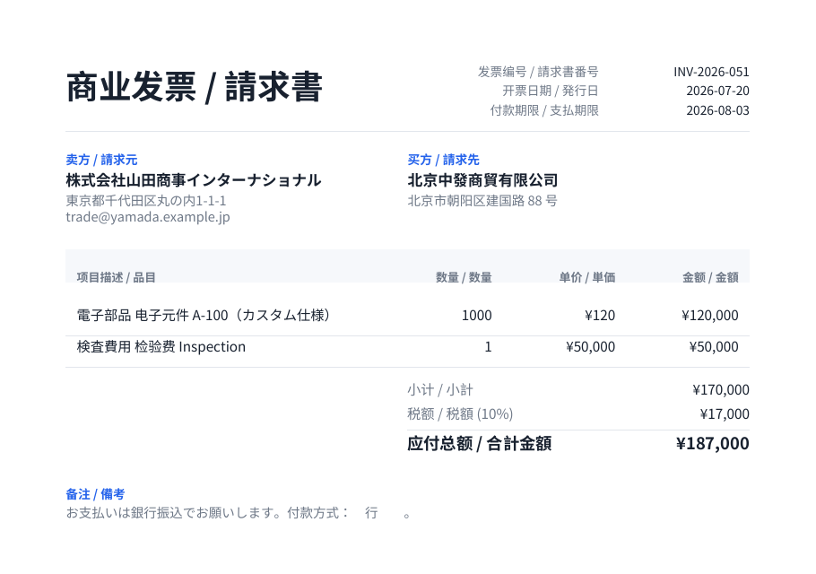

# Invoice PDF — a client-side invoice generator that takes CJK seriously

**Live: [invoices-generator.net](https://invoices-generator.net)** — free, no sign-up, no watermark, and nothing you type ever leaves your browser.

Invoice generators are a commodity. The interesting part of this one is what it took to generate **correct multilingual PDFs entirely in the browser**: Chinese (simplified *and* traditional), Japanese, Korean, Vietnamese, and mixed-script lines like `농산물 农产品 A급` — with no server round-trip, PDFs that stay in the 30–80 KB range, and a first-paint JS payload of ~7 KB.



12 invoice languages (en/zh/ja/ko/vi/es/de/fr/nl/it/pt/id), any two combinable into bilingual labels ("Amount / 金额"), 14 currencies with per-currency decimal, symbol-placement, and grouping rules (`¥1,000` · `1.000,00` isn't attempted — but `250,000 ₫` suffix and Swiss `CHF 1'000.00` are).



## The font rabbit hole

Rendering CJK text into a PDF **client-side** turned out to be the whole project. The path:

**Attempt 1: jsPDF.** Built-in fonts are Latin-only (the 14 standard PDF fonts). You can embed a custom TTF — but jsPDF doesn't subset it, so every Chinese invoice ships a ~2.5 MB font inside a 3 MB PDF. Dead end for an email attachment.

**Attempt 2: pdf-lib + @pdf-lib/fontkit with `subset: true`.** This is the documented path, and it *silently corrupts CJK glyphs*. Some characters render, others vanish — no errors thrown. We assumed our font pipeline was at fault until a controlled experiment: even a pristine, unmodified static TTF straight from Google Fonts loses glyphs when fontkit subsets it at embed time. CFF and TrueType flavors both. (`INVOICE / 商业发票` came out as `INV I  票`.)

**What shipped:** subset the fonts ourselves, twice.

1. **Build time** — `pyftsubset` cuts Noto Sans SC/JP/KR down to real-world charsets (SC: GB2312 ∪ JIS ∪ Big5 so one font covers simplified, Japanese kanji *and* traditional Chinese; JP: JIS X 0208; KR: KS X 1001 Hangul; plus Latin-Ext and the currency-symbol block everywhere). 2–6 MB per font, fetched lazily and cached — only when a CJK language is actually selected.
2. **Document time** — [HarfBuzz compiled to wasm](https://github.com/harfbuzz/harfbuzzjs) (~500 KB, adapted from the MIT-licensed `subset-font`) subsets the fetched font again down to *the exact characters on this invoice*, and pdf-lib embeds the result whole with `subset: false`, side-stepping the fontkit bug entirely. A bilingual invoice PDF lands at 30–80 KB.

See [`src/subset.js`](src/subset.js) and [`src/pdf.js`](src/pdf.js).

## Mixed-script lines need per-word font picking

No single font covers Korean + simplified Chinese (Noto Sans KR has no simplified ideographs; Noto Sans SC has no Hangul). Fontkit can't fall back mid-string, so the text renderer classifies each word by script — Hangul → KR, kana → JP, ideographs → SC/JP, Vietnamese diacritics and `₹ ₩ ₫` → a 70 KB Latin-Ext Noto subset — and draws runs with per-font width measurement for wrapping and right-alignment ([`src/pdf.js`](src/pdf.js), `makeStyler`).

Fonts are chosen by **content, not just settings**: paste a Chinese company name into an English invoice and the SC font loads automatically — previously that crashed Helvetica's WinAnsi encoder. Word-level (not char-level) classification keeps Vietnamese words like *Hạn* from being typeset in two different fonts.

Assorted scars: WinAnsi can't encode ₹/₫/₩ (auto-load the ext font); VND is zero-decimal and suffix-position; ICU's `de-CH` grouping apostrophe is U+2019, not ASCII; `currency` is a reserved GA4 parameter name; and third-party gtag.js costs ~25 mobile Lighthouse points unless you defer it to first interaction.

## Architecture

- **No framework, no server.** Vite MPA, vanilla JS. The PDF engine (pdf-lib + fontkit + HarfBuzz wasm, ~1.1 MB) is `import()`-ed only when the user clicks Download; first paint is ~7 KB of JS.
- **Hosting:** Cloudflare Workers static assets, plus a five-line worker for www→apex 301s.
- **Privacy:** drafts live in `localStorage`; the PDF is assembled on-device. There is no backend to leak anything.
- **Deep links:** landing pages preselect language/currency via `/?lang=de&currency=CHF`.
- Lighthouse: desktop 100/100/100/100, mobile 98–99.

## Development

```sh
npm install
npm run dev      # local dev server
npm run smoke    # 13-case matrix: en/zh/ja/ko/vi/es/nl/it/pt + mixed-script pairs,
                 # asserts PDF bytes, size windows, money math
npm run build    # static build to dist/
npm run deploy   # build + wrangler deploy
```

Browser e2e (drives the real app, downloads a bilingual PDF, checks the bytes):

```sh
CHROME_PATH=/path/to/chrome node scripts/e2e-download.mjs
CHROME_PATH=... E2E_URL=https://invoices-generator.net node scripts/e2e-download.mjs
```

Font subsets are committed under `public/fonts/`; regenerate with `python3 scripts/subset_fonts.py <dir with Noto variable TTFs>` (needs `fonttools`).

## Honest limitations

- **Commercial/proforma invoices only** — this is not a fiscal-document generator: no Chinese fapiao (发票), Japanese 適格請求書, Korean 세금계산서, e-invoicing XML (XRechnung, SdI, CFDI, NF-e), or Swiss QR-Rechnung payment parts. Every localized landing page says so explicitly.
- **No RTL or shaped scripts.** Arabic/Hebrew need bidi + shaping, Thai/Devanagari need shaping — pdf-lib's `drawText` does neither, and doing it right means running HarfBuzz for shaping, not just subsetting. Deliberately out of scope for now.
- **Charsets are bounded** by the build-time subsets; a truly rare ideograph or an emoji becomes tofu.
- Single template, no logo upload yet.

## License

[MIT](LICENSE). Font subsets in `public/fonts/` are derived from [Noto Sans](https://fonts.google.com/noto) (SIL OFL 1.1).
